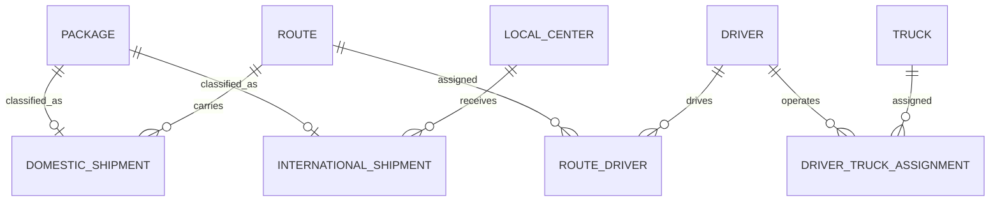

# Delivery Logistics Database

A relational model for packages, local distribution centers, trucks, drivers, routes, and domestic or international shipments.

The repository contains anonymized seed data, analytical queries, SQL Server programmability objects, and an isolated integration test.

## Changes from the original exercise

- All sample data is fictional. It contains no real tax identifiers or addresses.
- Relationship tables have explicit primary keys.
- The schema includes `CHECK` constraints, unique keys, and indexes.
- Schema, seed data, queries, programmability objects, and cleanup are separated.
- The trigger is set based and handles multi-row operations.
- The integration test runs against a temporary database.

## Model



## Repository structure

- `sql/01_schema.sql`: tables, constraints, and indexes
- `sql/02_seed.sql`: fictional sample data
- `sql/03_queries.sql`: demonstration queries
- `sql/04_programmability.sql`: view, stored procedure, and audit trigger
- `sql/99_reset.sql`: ordered object cleanup
- `tests/assertions.sql`: model invariants

## Run the integration test

The test requires SQL Server and `sqlcmd`. It creates a database named `PortfolioLogisticsTest_<identifier>`, loads every script, runs the assertions, and removes the database in a `finally` block.

```powershell
.\run-tests.ps1
```

To use another SQL Server instance:

```powershell
.\run-tests.ps1 -Server ".\SQLEXPRESS"
```

The programmability objects originated in coursework from `BD-2026-2`. The trigger uses the `inserted` and `deleted` logical tables and supports multi-row updates without a cursor.
