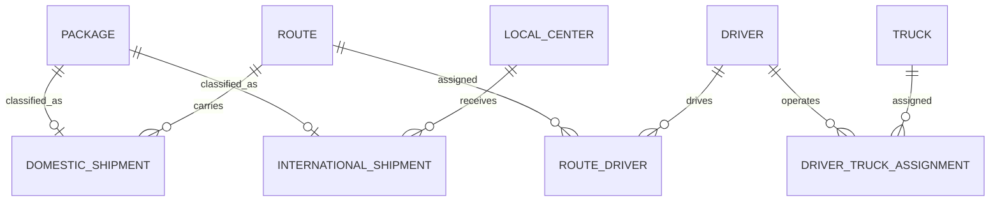

# Delivery Logistics Database

Modelo relacional para administrar paquetes, centros locales, camiones,
conductores, rutas y envíos nacionales o internacionales.

> **English summary:** A normalized SQL Server logistics database with
> anonymized seed data, analytical queries and an isolated integration test.

## Mejoras sobre el ejercicio original

- Datos de ejemplo completamente ficticios y sin RFC ni direcciones reales.
- Claves primarias en tablas de relación.
- Restricciones `CHECK`, claves únicas e índices.
- Separación entre esquema, datos, consultas y reinicio.
- Vista, procedimiento almacenado y disparador set-based.
- Prueba de integración sobre una base temporal.

## Modelo



## Archivos

- `sql/01_schema.sql`: tablas, restricciones e índices.
- `sql/02_seed.sql`: datos ficticios.
- `sql/03_queries.sql`: consultas demostrativas.
- `sql/04_programmability.sql`: vista, procedimiento y auditoría por disparador.
- `sql/99_reset.sql`: eliminación ordenada de objetos.
- `tests/assertions.sql`: invariantes del modelo.

## Probar

Requiere SQL Server y `sqlcmd`. La prueba crea una base con nombre
`PortfolioLogisticsTest_<identificador>`, carga todos los scripts, ejecuta las
aserciones y elimina esa base en un bloque `finally`.

```powershell
.\run-tests.ps1
```

Para usar otra instancia:

```powershell
.\run-tests.ps1 -Server ".\SQLEXPRESS"
```

Los objetos de programabilidad fueron incorporados a partir de ejercicios de
`BD-2026-2`. El disparador usa las tablas lógicas `inserted` y `deleted` de
forma set-based, por lo que soporta actualizaciones de varias filas sin cursor.
